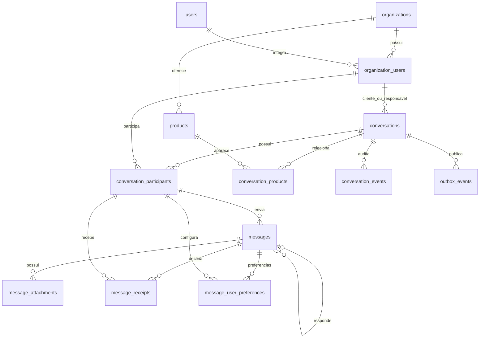

# Modelagem de chat para vendas e suporte

Modelo baseado no SQL original, ajustado para um chat dentro de um site. Alvo: **MySQL 8.4, InnoDB, utf8mb4 e horários em UTC**.

## Arquivos

- `schema.sql`: criação de 13 tabelas, uma trigger e uma view de entrega.
- `queries.sql`: consultas de referência para a futura API, com parâmetros ilustrativos.
- `validation.md`: cenários de aceitação para testar a integração em MySQL.

O schema é para uma instalação nova, não uma migração dos dados anteriores. Não contém DROP, não desativa chaves estrangeiras e não deve ser reaplicado sobre tabelas existentes. Execute somente `schema.sql` como script de instalação. `DELIMITER` é uma instrução do cliente MySQL/Workbench; um framework de migrations deve enviar o corpo completo da trigger em uma única instrução, sem enviar `DELIMITER` ao servidor.

## Premissas de produto

- Chat próprio do site; não é integração com a API oficial do WhatsApp.
- Uma conversa representa um atendimento de vendas ou suporte. Um cliente pode ter várias conversas, inclusive simultâneas.
- Uma conversa pode envolver cliente, atendente e supervisor. Sem limite artificial de duas pessoas.
- Para um único site/loja, cadastre somente uma organização. O isolamento também permite futuras lojas.
- Cadastro por telefone não é obrigatório. Visitantes são usuários identificados por uma sessão segura emitida pelo servidor.
- Se já existem usuários e produtos no site, adaptar as FKs para essas entidades antes da implantação, evitando cadastros duplicados.
- Divulgação significa conversar sobre produtos do catálogo. Disparo em massa, campanhas e listas de transmissão não estão incluídos.
- Ao ingressar, um participante autorizado acessa o histórico inteiro dessa conversa. O sistema não fornece notas internas entre atendentes: use os eventos de auditoria somente em endpoints internos.

## Entidades

| Tabela | Finalidade |
|---|---|
| organizations | Empresa ou loja responsável pelo atendimento. |
| users | Identidade global; nome e contatos opcionais. |
| organization_users | Vínculo, papel e suspensão do usuário dentro da empresa. |
| products | Referência mínima ao catálogo de produtos. |
| conversations | Cliente, responsável, assunto, finalidade, fila e encerramento. |
| conversation_products | Produtos envolvidos, com nome preservado no momento do vínculo. |
| conversation_participants | Participantes e preferências de arquivamento, fixação e silêncio. |
| messages | Texto/legenda, resposta, idempotência, edição, exclusão e expiração. |
| message_attachments | Metadados dos arquivos armazenados de forma privada. |
| message_receipts | Destinatários e confirmações individuais de entrega/leitura. |
| message_user_preferences | Favoritos e ocultação individual de mensagens. |
| conversation_events | Histórico interno de atribuições, status e participantes. |
| outbox_events | Eventos pendentes de publicação após a transação do banco. |

## O que o banco garante

- FKs compostas impedem vincular mensagens, produtos, participantes e anexos a uma empresa/conversa diferente da indicada.
- O autor de uma mensagem deve existir como participante daquela conversa. Estar **ativo** é uma validação adicional da API.
- Uma resposta só aponta para uma mensagem da mesma conversa e empresa.
- A combinação empresa + conversa + remetente + `client_message_id` é única.
- Cada usuário tem um único recibo e uma única preferência por mensagem.
- Leitura exige entrega e não pode ter horário anterior à entrega.
- Encerramento exige `closed_at`; conversas abertas não mantêm essa data.
- Texto não pode estar vazio. Apagar para todos exige limpar `body`.
- Arquivos têm tamanho maior que zero e teto de 100 MiB. A API pode impor limites menores por tipo.
- No envio, a trigger registra os demais participantes ativos como destinatários, atualiza a atividade e cria `message.created` na outbox. Tudo participa da mesma transação.
- A view nunca classifica uma mensagem sem destinatários como lida.

Os IDs são globais, mas os relacionamentos incluem `organization_id` para garantir consistência entre empresas. As chaves únicas compostas aparentemente redundantes são intencionais: servem como alvos completos de FKs.

## O que a API deve garantir

As FKs protegem integridade dos dados; **não substituem autorização de consultas**.

1. Autenticar o usuário e validar seu vínculo ativo com uma organização ativa. Não aceitar `sender_id`, papéis ou empresa diretamente do navegador como prova de identidade.
2. Usar a autenticação existente do site ou um provedor. Email e telefone neste modelo são contatos, não mecanismos de login. Para visitantes, emitir uma sessão opaca e protegida; conhecer um `user_id` não dá acesso à conta.
3. Validar que o cliente da conversa tem papel `customer`, que o responsável tem papel `agent/admin` e que ambos participam da conversa. Uma conversa pode começar sem responsável, mas deve começar com o cliente como participante.
4. Permitir inclusão/remoção/atribuição apenas a funcionários autorizados. Não permitir que um cliente adicione outro cliente nem retire o cliente titular. Não remover fisicamente participantes com histórico; preencher `left_at`.
5. Autorizar toda operação: listar conversas, histórico, anexos, respostas citadas, recibos, favoritos, auditoria e inscrições WebSocket. A equipe pode acessar uma fila por papel; para enviar mensagens deve ingressar na conversa.
6. Impedir envio por participantes que saíram, por usuários suspensos e em conversas fechadas. A política de reabertura deve ser explícita e auditada.
7. Validar UUID de `client_message_id`, tamanho de texto, conteúdo, tipo real do arquivo, resultado da verificação e regras para edição/exclusão. Não permitir alterar empresa, conversa, autor ou data original de uma mensagem existente.
8. Exigir pelo menos um anexo para `message_type='attachment'` antes do COMMIT. Usar `text` somente para texto sem anexos; a mensagem `attachment` pode ter legenda e vários arquivos.
9. Validar que a mensagem respondida é acessível e não é a própria mensagem. Ao exibir uma citação, reaplicar as regras de exclusão, expiração e ocultação do usuário.
10. Atualizar apenas os recibos do usuário autenticado e usar horários do servidor. Entrega significa confirmação do aplicativo destinatário, não publicação na outbox.
11. Filtrar mensagens expiradas e ocultadas em histórico, busca, prévias, anexos e notificações. Para apagadas, retornar um marcador sem corpo nem anexos. `expires_at` não remove conteúdo automaticamente.
12. Manter `conversation_events` somente por acréscimo. A API deve registrar criação, mudanças de responsável/status e entradas/saídas na mesma transação da mudança.

Uma conta tem um papel por empresa neste MVP. Se um funcionário também precisar atuar como cliente da mesma empresa, evoluir para associação de múltiplos papéis, sem reutilizar indevidamente uma conversa de outro cliente.
